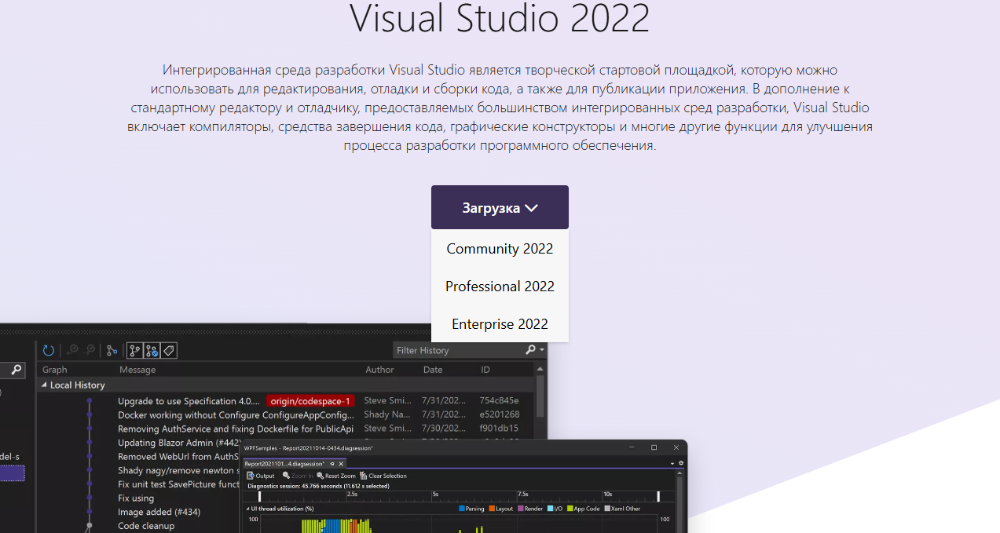
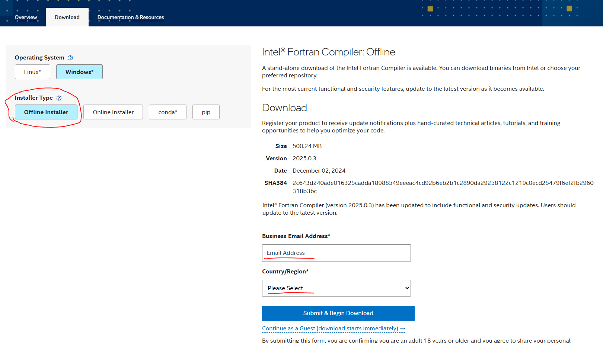
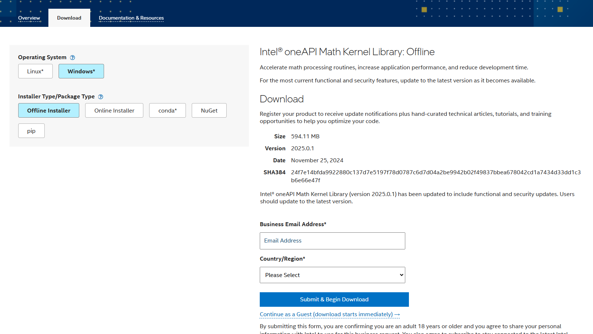

## Встановлення компілятора Intel Fortran 2025

1) Попередньо необхідно встановити MS Visual Studio. Завантажте Community версію з офіційного сайту [за посиланням](https://visualstudio.microsoft.com/)
<div style="text-align: center;">
    
</div>

2) Запустіть інталлятор, погодьтеся з умовами ліцензії. Коли виникне екран з вибором payloads, виберіть **"Desktop C++ development"**. 

3) Перейдіть на сайт Інтел на сторінку завантаження компілятора [за посиланням](https://www.intel.com/content/www/us/en/developer/tools/oneapi/fortran-compiler-download.html). Бажано вибрати offline інсталлятор. Не забудьте вказати свій e-mail та регіон.
<div style="text-align: center;">
    
</div>

4) Запустіть інсталлятор, погодьтеся з умовами ліцензії і дочекайтеся до завершення процесу інсталляції. Він може бути доволі тривалим (від 10 до 20 хвилин в залежності від швидкодії вашої машини).

5) Перевірте інсталляцію запустивши наступні команди
```batch 
@echo off
call "C:\Program Files (x86)\Intel\oneAPI\setvars.bat"
ifx test.f90
test.exe
```
Для тесту використайте найпростішу програму

```fortran
program test
  print *, "Hello, world!"
end program test
```
Якщо вона виконується успішно, можете перейти до наступного кроку

6) Цей крок не є обов'язковим, якщо ви не збираєтеся використовувати фунцкції бібліотеки MKL! Перейдіть за [посиланням](https://www.intel.com/content/www/us/en/developer/tools/oneapi/onemkl-download.html) і завантажте бібліотеку. Виберіть offline інсталлятор і також не забудьте вказати країну та регіон.
<div style="text-align: center;">
    
</div>
Запустіть інсталлятор, прийміть умови ліцензії і дочекайтесь завершення процесу. 
