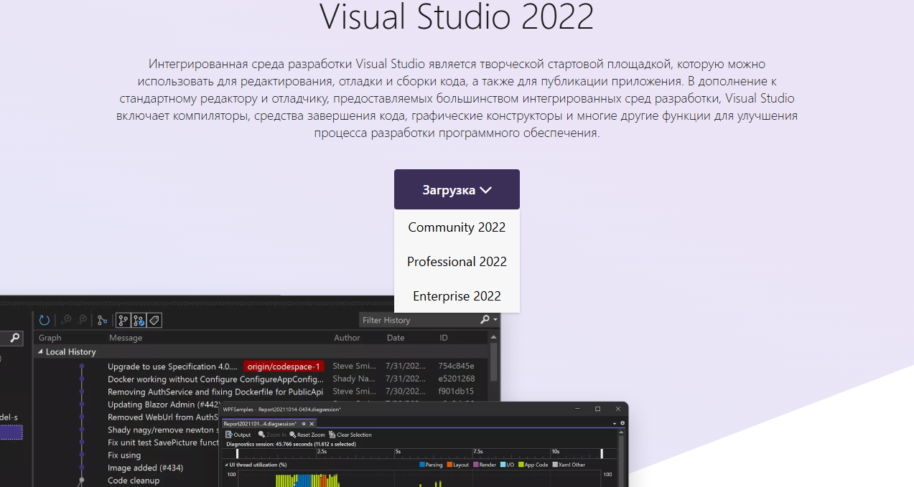
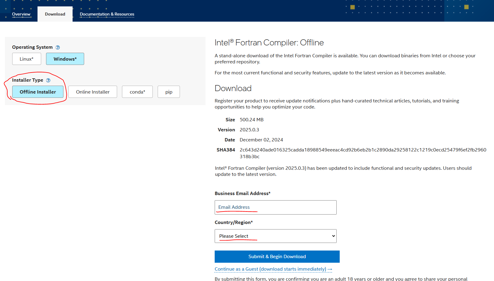

## Installing Intel Fortran 2025 Compiler

1) First, you need to install MS Visual Studio. Download the Community version from the official website [via this link](https://visualstudio.microsoft.com/)
<div style="text-align: center;">
    
</div>

2) Run the installer, accept the license terms. When the payloads selection screen appears, select **"Desktop C++ development"**.

3) Go to the Intel website's compiler download page [via this link](https://www.intel.com/content/www/us/en/developer/tools/oneapi/fortran-compiler-download.html). It's recommended to choose the offline installer. Don't forget to specify your e-mail and region.
<div style="text-align: center;">
    
</div>

4) Run the installer, accept the license terms and wait for the installation process to complete. It can be quite lengthy (10 to 20 minutes depending on your machine's performance).

5) Verify the installation by running the following commands
```batch 
@echo off
call "C:\Program Files (x86)\Intel\oneAPI\setvars.bat"
ifx test.f90
test.exe
```
For testing, use the simplest program

```fortran
program test
  print *, "Hello, world!"
end program test
```
If it runs successfully, you can proceed to the next step

6) This step is not mandatory if you're not planning to use MKL library functions! Go to [this link](https://www.intel.com/content/www/us/en/developer/tools/oneapi/onemkl-download.html) and download the library. Choose the offline installer and don't forget to specify your country and region.
<div style="text-align: center;">
    
</div>
Run the installer, accept the license terms and wait for the process to complete.